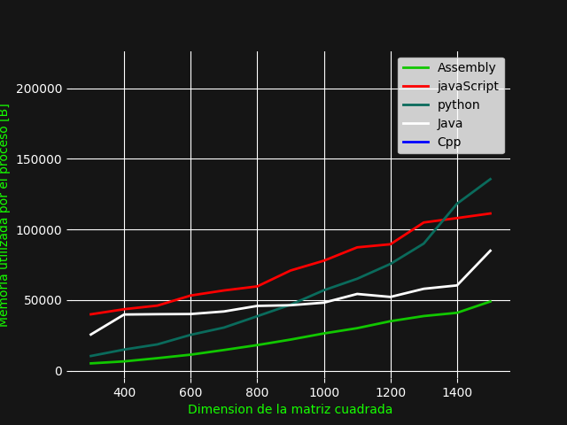

## Integrantes:

- Juan Sánchez
- Mateo Ruiz
- Roberto Alvarado

## Objetivos:

- [x] Realizar un análisis comparativo de las diferentes tecnologías para el manejo de memoria
- [x] Implementar en diferentes lenguajes de programación un programa para la multiplicación de matrices
- [x] Comparar el uso de memoria y la eficiencia entre lenguajes de programación 

## Metodología:

Para la realización de este proyecto se hará uso de las herramientas de cada
lenguaje de programación para la implementación de un algoritmo para crear una
matriz cuadrada de dimensión n aleatoria, seguidamente se realizará la
implementación de un algoritmo de multiplicación de matrices, se busco
generalizar cada paso y las librerías utilizadas de forma que la comparación
entre lenguajes no tenga variables no controladas. Por lo tanto se espera que
la única variable que se cambiará es el lenguaje en si mismo. 

Para cada lenguaje la implementación es diferente, pero para analizar como cada
algoritmo lo maneja, se correrá cada lenguaje con matrices que vayan de una
dimensión 300 a 1500 en saltos de 100. Para todo el análisis de memoria
y tiempo se harán usos de los recursos de la linea de comandos de Linux

- time [process] : Permite medir el tiempo que le toma realizar al
  computador computar el proceso _process_, este nos ayudará a ver el tiempo que le toma
  cada lenguaje realizar el proceso 

- top : Permite mostrar todos los procesos que están activos dentro de Linux,
  este también da especificaciones de la memoria utilizada

- grep : permite encontrar strings en un archivo 
 
A continuación se presenta el pseudocode que se utiliza como base del código 

### Pseudocode 

        function randomMatrix is 
            input:
            n -> rank of the square matrix
            output:
            r -> random square matrix of rank n

        implementation:
            let r -> empty array
            for i in range n
                let aux = []
                for j in range n
                    aux.append(randomNumber())
                end
                r.append(aux)
            end
            return r
        function matMul is
            input:
            n -> rank of the square matrix
            m1 -> matrix 1 factor
            m2 -> matrix 2 factor
            output:
            r -> result matrix

        implementation:
            let r -> empty array
            for i in n
                let aux = []
                for j in n
                    let sum = 0
                    for k in n
                        sum += m1[i][h]*m2[h][j]
                    aux.append(sum)
                r.append(sum)
            return r

### Script de prueba

Para la obtención de datos vamos a hacer uso de un script que nos permite
encontrar los datos que estan dentro de top y obtenerlos dentro de un archivo
más manejable, ya que estamos trabajando con procesos que algunos son muy
rápidos entonces para eso es necesario que hagamos este proceso. 

El script para JavaScript es el siguiente

        #!/bin/bash
        
        echo "Codigo Iniciado"
        top -b -d 0.1 > top.txt & node matMul.js
        echo "Codigo terminado"

        grep node top.txt>resultados

Con este script es posible la obtención de toda la memoria utilizada cada 0.1 segundos
entonces para poder analizar y manejar es necesario tomar el valor más alto de
cada proceso con el fin de comparar estos valores

### Algoritmo de multiplicación de matrices

Algo importante que hay que mencionar antes del análisis de los tiempos es que
algoritmo de multiplicación de matrices se utilizará, en este caso ya que
buscamos forzar a la computadora, se utiliza lo que se conoce como una
multiplicación iterativa, de cierta manera es como la multiplicación más
simple de matrices, y para poner en contexto es la primera que se enseña al
momento de multiplicar matrices. Fila por columna y seguimos... 

Este proceso tiene una complejidad de  __O(n^3)__, una complejidad muy alta! Es
por eso que es importante que existen procesos y algoritmos que se han mostrado
con una complejidad menor. Hasta la actualidad el mejor caso,es el algoritmo de
Strassen que representa una complejidad de O(n^2.89). Pero el metodo de _divide
and conquer_ sabemos que tenemos un mejor resultado.

Es importante reconocer esto ya que existen varios casos que no se analizan
y se sabe que es mucho más eficiente, por ejemplo, numpy, una libreria de
python, maneja la multiplicación de matrices con un método conocido como BLAS,
entonces, es mucho más rápido que el cúbico
 
## Multiplicación de matrices en cada lenguaje

[Python](./subpages/python.md)\\
[Java](./subpages/java.md)\\
[JavaScript](./subpages/javaScript.md)\\
[C++](./subpages/cpp.md)\\
[Assembly](./subpages/assembly.md)

## Resultados 
Los resultados de todos los lenguajes se presentan a continuación,

La relación de dimensión y tiempo 

La relación de dimesión y memoria 

## Conclusiones

- Basado en la 

### [Referencias](./subpages/referencias.md)

