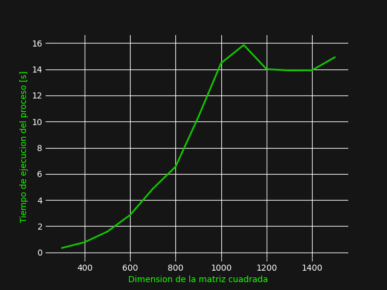
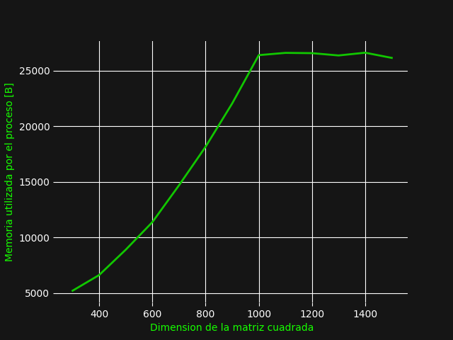

# Assembly

Assembly es un lenguaje de progresión de bajo nivel que utiliza los comandos del
procesador para la escritura de código. Como es un lenguaje de bajo nivel, se
podría esperar que sea antiguo, y es cierto. Se presenta por primera vez en
1949 y es un lenguaje muy eficiente, en si su eficiencia se ve contrarrestada con 
su dificultad de escritura. Esta dificultad, sin embargo, para el contexto que
se presenta, es una simplificación del lenguaje binario.

##Manejo de memorión este caso el manejo de memoria es
En este caso el manejo de memoria completamente directo, no tiene ningún tipo
de manejo que no sea la asignación de memoria y la obtención de memoria. A
diferencia de otro tipo de lenguaje, es posible, calcular de manera directa la
cantidad de memoria que se utilizará simplemente con ver el código y las
variables declaradas. Aquí es muy sencillo entender como funciona el ciclo de
memoria de asignación, escritura y obtención de memoria. Existe una instrucción 
(En realidad son más, pero en general todas tienen la misma idea)

        mov dir1, dir2

Este opcode, en si es el que nos permite acceder y guardar memoria, _mov_ lo que
hace es que mueve los datos que se encuentran en la dirección1 (dir1) a la
dirección2 (dir2), eso nos permite hacer el movimiento de memoria y nos permite
acceder. 

# Resultados 

[Assembly Code](../code/matMul.asm)

La relación según la dimensión y el tiempo de ejecución 

La relación según la dimensión y el tiempo de ejecución 

Pero aquí nos presentamos con el primer problema, el compilador nasm, que es el
que se utilizó para las pruebas de assembly tiene una limitación de memoria virtual
debido a que si se utiliza más podría llevar a que existan fallos de seguridad
dentro del sistema operativo, entonces se tuvo que pasar a una maquina virtual
donde se utilizo el compilador de Intel, y se obtuvieron los siguientes resultados

    
