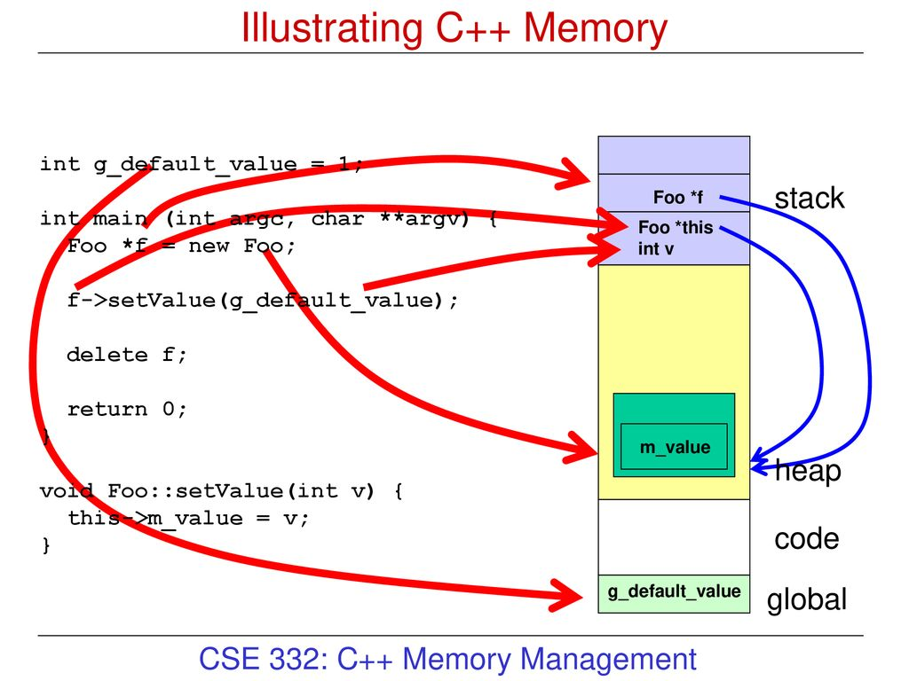
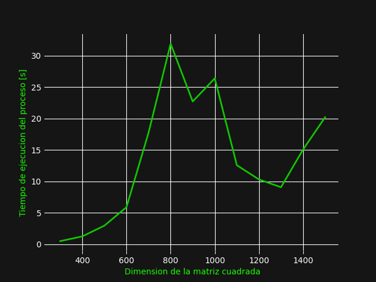
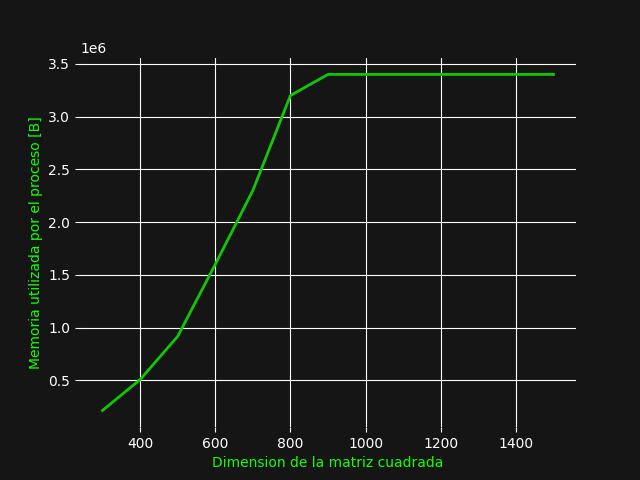

# C++

El manejo de memoria de C++ utiliza dos esructuras para manejar los objetos y las variables. 

La primera estructura se llama el heap, que aquí se almacenan todos los objetos de la aplicación, esta memoria si tiene que ser liberada y  
no tiene limite de tamaño aparte del disponible de RAM, en este caso el manejo de memoria del heap es completamente manual, hay que especificar la memoria que se dispone a procesos y eventualmente librar esa misma memoria. 
La manera que se hace memory allocation es con los métodos new y el memory deallocation ocurre con delete.

El segunda de estas estructuras se denomina Stack, utiliza el model LIFO. 
Es una estructura que es parte del RAM y es donde se guardan las variables locales, estas variables locales existirán en el scope de la funcion que llama a estas variables. 
El método new también guarda en el stack el puntero a la posición de memoria del heap que se encuentra vacia, esto con la intención de que se use ese puntero para poblar la posición de memoria, adicionalmente aquí se guardan todas las variables locales de funciones que ocurren en el programa.

Debido a que este lenguaje no tiene un garbage collector el uso de memoria cae completamente en el manejo de memoria manual dentro del programa.

 

# Resultados
[Codigo C++](../code/matMul.cpp)
Relación dimensión vs tiempo

Relación dimensión vs memoria

