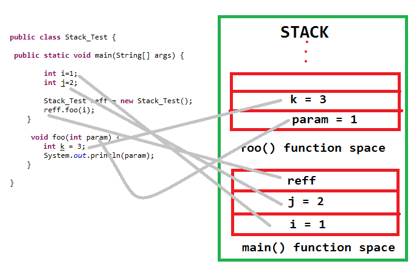
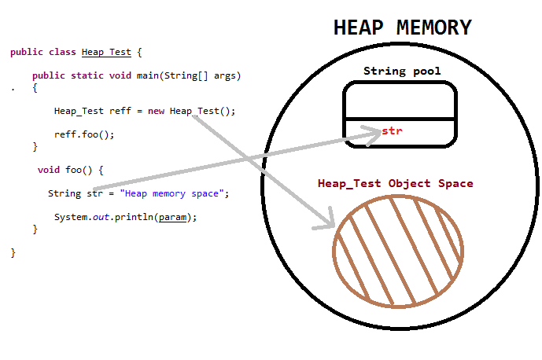
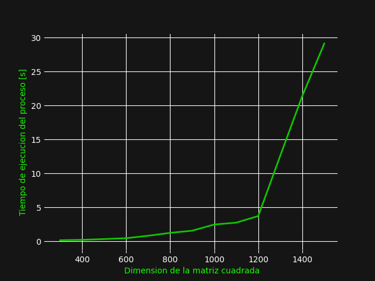
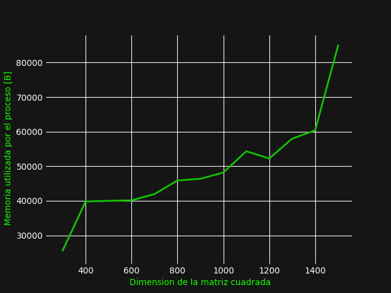

#Java

##Manejo de memoria en Java

El manejo de memoria de Java utiliza dos esructuras para manejar los objetos y las variables. 

El primero de estas estructuras se denomina Stack, utiliza el model LIFO. Es una estructura que es parte del RAM y es donde se guardan las variables locales, estas variables locales existirán en el scope de la funcion que llama a estas variables.
El stack va a tener un tamaño variable dependiendo de la aplicación ya que depende de cuantas variables estén presentes, este también va a tener un tamaño máximo dependiendo del RAM disponible y un tamaño determinado por el OS, aquí no se tiene que manejar el uso de memoria ya que la memoria se usa y se libera en el proceso de uso de datos.

La segunda estructura se llama el heap, que aquí se almacenan todos los objetos de la aplicación, la gran diferencia es que esta memoria si tiene que ser liberada y adicionalmente el heap no tiene limite de tamaño aparte del disponible de RAM. 
Para el proceso de liberar memoria del heap, Java utiliza una herrramientta que se denomina Garbage collector, que con la metodología FIFO libera memoria cuando se necesita para hacer espacion para objetos nuevos. Para poder liberar memoria JVM separaa el heap en dos partes uno de Young space y otro de Old space, old space contiene los objetos que están disponibles eliminados por el garbage collector.    

Debido a que Java utiliza un garbage collector el uso de memoria de java es sumamente alto ya que va a utilizar la mayor cantidad de memoria que se lo permita antes de tener que eliminar cosas con el garbage collector. 

# Resultados

Relación dimension vs tiempo de ejecución 

Relación dimensión vs memoria

