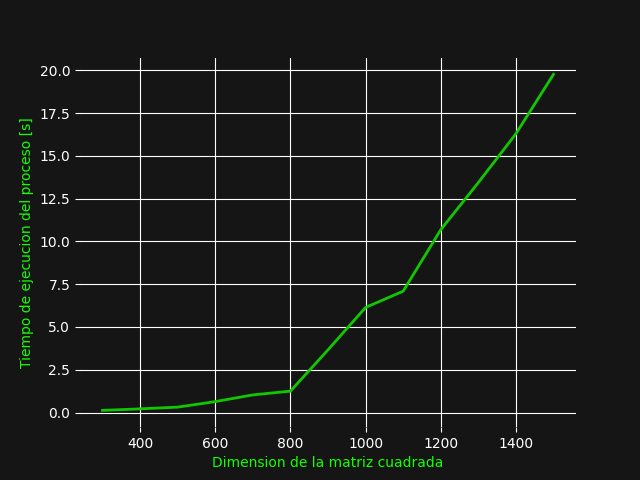
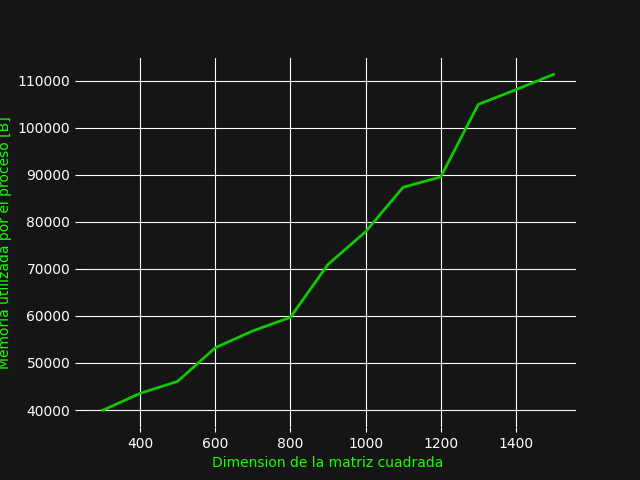

# JavaScript 

JavaScript es un lenguaje de programa creado en el año de 1995 por Brendan
Eich, esta inspirado en lenguaje Java, Self y Scheme. Durante los últimos
10 años ha sido el lenguaje de programación más popular según _StackOverflow
Developer Survey._ En si es un lenguaje de programación que permite en su forma
más pura el manejo de páginas web, se basa en un lenguaje del lado del cliente,
que se refiere que el código corre en el navegador en si, dentro de una maquina
virtual, de la misma forma que el lenguaje Java. JavaScript gracias a su
popularidad ha sido la base para la creación de frameworks que han extendido su
funcionalidad a no solamente el manejo de páginas web.

En el 2005, se presenta el artículo, _Ajax: A New Approach to Web Applications_
escrito por Jesse James Garrett. En este se presenta por primera vez un nuevo
paradigma para el manejo de páginas web.

En este es la primera vez que se presenta a JavaScript como la base de un
modelo que permita que los programas web tengan un aspecto y un manejo como una
aplicación de escritorio.

## Manejo de memoria ##

Asumiendo que se manejan los conceptos básicos de memoria, al hablar del uso de
memoria dentro del lenguaje de JavaScript es muy directo. Al igual que otros
lenguajes de alto nivel, la memoria es asignada(allocated) de manera
automática, sin la necesidad que el programador lo haga manualmente. Por
ejemplo, al momento que dentro del código se definen variables 

        let var = 3;
        let var1 = {
            att1 : 1, 
            att2 : 2 
        }

Tanto para _var_ como para _var1_ se asigna memoria al momento que se definen
estas variables. De la misma manera funciona con Objetos de una clase definida.

Ya que JavaScript tiene sus bases en Java, tomo su idea del __garbage
collector__, dentro de lenguajes de programación que no se hace uso de esta
técnica, es necesario que el programador se encargue de la liberación de
memoria con el fin de no crear problemas, sin embargo, JavaScript con el
__garbage collector__, hace uso de métodos y algoritmos para definir espacios
de memoria que no estám siendo utilizados y que se espera que no sean
utilizados para liberar esa memoria. Este proceso es automático y existen
varios métodos para hacerlo, dentro de JavaScript existen varios, pero uno de
los principales es el algoritmo de Mark-and-Sweep.

### Algoritmo de Mark-and-Sweep 

Este proceso se basa en 3 partes: 

    1. Encontrar lo que se conoce como raíces, que en si son variables
       globales, que para algún momento son referenciadas por el código,
       estos se identifican y se anotan dentro del __garbage collector__
    
    2. Para cada raíz, se hace un seguimiento de todos los espacios de memoria
       que son referenciados por la raíz actual, este proceso continúa hasta
       llegar a un punto donde no se puede continuar, para entonces se sigue
       a la siguiente raíz. Si es referenciado, es marcado como útil. 

    3. Todo aquel espacio de memoria que no haya sido marcado por el proceso
       anterior es considerado como inútil y es considerado como basura

# Resultados del experimento 
Antes de iniciar es posible visualizar el [Codigo en Java](../code/matMul.js).
Todos los resultados se consiguieron mediante el proceso descrito en la metodología.

Primeramente se presenta en el siguiente gráfico la relación de dimensión de la
matriz con el tiempo de ejecución 

Seguidamente se presentan los datos de la relación de la dimensión con la memoria utilizada

