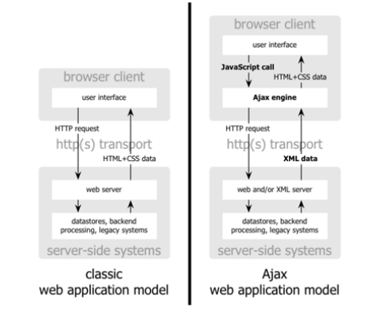

# JavaScript 

JavaScript es un lenguaje de programa creado en el año de 1995 por Brendan
Eich, esta inspirado en lenguaje Java, Self y Scheme. Durante los últimos
10 años ha sido el lenguaje de programación más popular según _StackOverflow
Developer Survey._ En si es un lenguaje de programación que permite en su forma
más pura el manejo de páginas web, se basa en un lenguaje del lado del cliente,
que se refiere que el código corre en el navegador en si, dentro de una maquina
virtual, de la misma forma que el lenguaje Java. JavaScript gracias a su
popularidad ha sido la base para la creación de frameworks que han extendido su
funcionalidad a no solamente el manejo de páginas web.

En el 2005, se presenta el artículo, _Ajax: A New Approach to Web Applications_
escrito por Jesse James Garrett. En este se presenta por primera vez un nuevo
paradigma para el manejo de páginas web.

En este es la primera vez que se presenta a JavaScript como la base de un
modelo que permita que los programas web tengan un aspecto y un manejo como una
aplicación de escritorio.

## Manejo de memoria ##

Asumiendo que se manejan los conceptos básicos de memoria, al hablar del uso de
memoria dentro del lenguaje de JavaScript es muy directo. Un concepto básico

