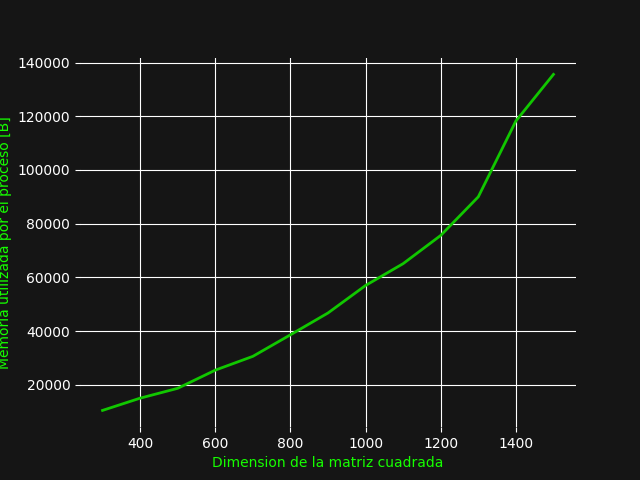

# Python 

Python utiliza un heap privado que contiene todos los objetos y estructura de
datos del lenguaje, por tanto, internamente posee el administrador de memoria,
el cual gestiona el heap privado. Por tal motivo, este administrador posee
componentes que permiten la gestión dinámica de almacenamiento, almacenamiento
de cache, segmentación entre otros. Cuando nos encontramos en el nivel mas
bajo, un asignador se asegura de que exista espacio suficiente en el heap
privado para almacenar los datos de Python cuando existe alguna interacción,
del mismo modo, este asignador actúa diferente para cada tipo de objeto. Por
ejemplo, en el caso de los objetos de tipo entero, estos se administran dentro
de diccionarios, tuplas o cadenas ya que estos compensan velocidad y espacio
y al mismo tiempo su almacenamiento es variable. Para poder conocer el
comportamiento de Python en la memoria de nuestra computadora, procederemos
a ejecutar un código que consiste en la creación y multiplicación de un arreglo
de 1000 x 1000.

__Antes de empezar, mostraremos la memoria del dispositivo antes de ejecutar el programa:__

__A continuación, se presenta el uso de memoria al ejecutar pyhton3, sin ningún proceso:__

__Se procede a correr nuestro programa:__

Como se puede apreciar, el uso de memoria al empezar a ejecutar la memoria es
completamente evidente, el cual va aumentando conforme pasa el tiempo,
denotando que no solo incremente el uso de la memoria física, sino que la
memoria virtual también aumenta para seguir el proceso.

__A continuación, se presenta el uso de memoria del dispositivo después de finalizar el proceso:__

Como se pudo apreciar, el programa empezó con una memoria inicial de 23280
y termino con un uso de memoria de 59848 Y que en este caso el tiempo que
demoro para terminar de ejecutar el programa fue de 2 minutos. Otro caso: En
este momento vamos a probar la ejecución de otro programa que sigue con los
mismo lineamientos y objetivos del anterior, por tanto, esta vez vamos a correr
un programa Python que use la librería numpy para crear nuestro arreglo de 1000
x 1000.

__Siguiendo los mismos lineamientos presentamos la memoria ejecutando Python sin ningún proceso:__

__A continuación, presentamos el valor de la memoria después de correr el programa:__

Como podemos apreciar el tiempo de ejecución del programa fue poco mas de
1 segundo, demostrando así la agilidad que posee la librería numpy, sin
embargo, podemos apreciar que la memoria que ocupa el programa es de 1.5 gigas,
ósea que ocupa el triple de memoria que anterior programa. En este caso la
principal diferencia entre ambos programas es que la que no usa numpy va
generando números aleatorios y los va agregando hacia nuestra matriz, y que por
tanto el contenedor de memoria se va a ir ocupando y asignando conforme a esta
va creciendo, por otro lado, la librería numpy guardaría un espacio de memoria
para el tamaño de la matriz ya continuación agregaría cada valor a ese espacio
reservado, ocasionando que ocupe mas espacio, pues no solo guarda el valor,
sino que también guarda la reserva y dirección para guardar el valor.

# Resultados
[Codigo python](../code/matMul.py)
Relacion dimension vs tiempo

Relacion dimension vs memoria

